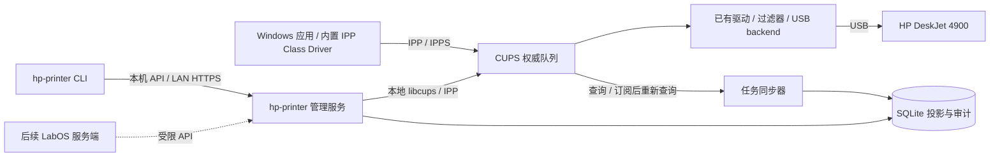

# 02 架构与封装边界

[返回主计划](README.md) · [队列与 API](03-queue-and-api.md)

## 1. 本地优先拓扑



现有具体路径为 `HP_DeskJet_4900 → ipp://localhost:60000/ipp/print → ipp-usb → USB`。CUPS 报告队列使用 `Printer - IPP Everywhere`；这是已存在的配置，不是本项目重新创建的队列。Windows 使用操作系统内置 Microsoft IPP Class Driver，不要求用户另外安装 HP 厂商包；树莓派端的 CUPS/ipp-usb 负责服务队列、转换可处理格式并连接 USB 打印机。后续不因型号名称就重建现有队列。[OpenPrinting CUPS](https://openprinting.github.io/cups/)

## 2. 单一排队权威

Windows 原生打印不经过 FastAPI。CLI 通过 API 使用同一套 SubmissionService/ControlService，不能另建直接输出 USB 的执行器。因此所有任务最终进入同一个 CUPS 队列，应用不直接访问打印机、不读取/搬动 CUPS spool 文件。

Windows 本机在网络中断时可能暂存未送达任务；只有 CUPS 接收的任务才进入树莓派统一队列。CLI/API 明确说明树莓派的可见范围，不能把服务端查不到任务说成客户端没有待打印文件。

API 中 `print_job` 是 CUPS 作业的本地投影，额外保存来源、幂等键、操作审计和同步时间。工作进程失败时，已进入 CUPS 的原生任务仍可继续打印；CUPS 不可用时管理服务返回降级状态，不返回虚假“空队列”。

## 3. 组件职责

| 组件 | 责任 | 不承担 |
|---|---|---|
| CUPS | spool 持久化、队列、驱动转换、USB 输出、原生协议 | LabOS 身份/项目业务 |
| `CupsAdapter` | 只暴露允许的队列/作业操作，归一化属性与异常 | 任意命令执行、动态改驱动 |
| `InventoryService` | 设备身份、队列 UUID、能力与状态采样 | 自动发现就自动接管所有打印机 |
| `JobReconciler` | 全量/增量对账、导入 Windows 任务、恢复状态 | 根据旧 DB 状态重放打印 |
| `SubmissionService` | PDF 验证、上传临时文件、幂等提交映射 | 重复创建不确定作业 |
| `ControlService` | 管理员操作、权限、乐观前置条件、审计 | 默认为所有成员提供管理员权力 |
| `DiagnosticsService` | 有限诊断与脱敏报告 | 读取文档内容、导出完整网络/系统秘密 |
| CLI / API client | 文件流提交、登录、查询/控制、诊断、人类/JSON 输出 | 直接操作 USB、另建 SQLite 权威数据或默认绕过服务 |

## 4. 运行与工程方案

采用 Python + uv 单包工程，建议 Typer、HTTPX、FastAPI、Pydantic、libcups/pycups、SQLite。基线为 Ubuntu 24.04.4 arm64、Python 3.12.3、CUPS 2.4.7；尚未安装 python3-cups。pycups 声明为服务端依赖，通过 uv 在独立 .venv 中安装；系统 libcups 及编译工具单独预检，不依赖系统 python3-cups 自动出现在虚拟环境中。libcups 调用放受控线程/工作进程，设超时；不可中断的库调用需进程隔离，避免长期占满 HTTP 工作线程。

systemd 运行受限 `hp-printer` 用户；CUPS 由系统维护。修改 CUPS 的高权限动作通过限定的操作策略/本地接口授权，不提供万能 sudo shell。初期同一服务包含 API 与单实例同步 worker；需要拆进程时使用数据库 lease 确保只一个同步器。

SQLite WAL 适合单 Pi 小规模元数据；不承担文档 spool。历史无限增长、SD 卡写入与磁盘余量纳入运维。无 Redis/MinIO/消息队列前置依赖。

建议后续目录如下，当前仅 README/docs 已创建：

```text
hp-printer/
  pyproject.toml            包元数据、依赖、CLI 入口、构建和检查配置
  uv.lock                   已验证的依赖锁文件
  .python-version           Python 3.12 基线
  src/hp_printer/
    cli/                    Typer 命令与输出
    client/                 HTTP 客户端、CLI 凭据/请求记录
    api/                    FastAPI 路由和认证
    services/               提交、控制、对账、诊断
    adapters/               CUPS 适配器
    persistence/            SQLite 模型与迁移
    config.py               配置和环境校验
  contracts/                OpenAPI、状态/事件 Schema
  scripts/pi/               inspect / install / doctor / backup / uninstall
  scripts/windows/          Add / Test / Remove-LabPrinter.ps1
  deploy/                   systemd、配置模板、受限 CUPS policy
  tests/                    adapter、契约、故障注入
  docs/                     计划、设备基线、实测记录
```

不创建 frontend/ 或 backend/ 嵌套工程，不引入 React、Node 或 pnpm。通过 `[project.scripts]` 提供 `hp-printer` 命令，开发使用 `uv run`；具体命令、依赖拆分和 systemd 运行方式见 [CLI 与 uv 工程](08-cli-and-uv.md)。

## 5. 权限与地址边界

LAN 只开放明确需要的打印协议地址，CUPS 管理/配置入口限管理员来源并鉴权；控制服务与原生打印可以有不同端口/证书策略。局域网不是用户身份认证。

`requesting-user-name` 和作业标题属于客户端自报数据。默认原生队列可采用受限 LAN 设备准入，但管理员跨用户控制要认证；不以该字符串实现财务配额、本人文件下载或可信成员统计。强身份打印若成为需求，先做 Windows/CUPS 认证可用性试验，再选 Kerberos/认证 IPP 等方案。

CLI 登录使用管理 API 的认证机制，Windows 原生 IPP 仍采用已确认的 LAN 直接打印策略；CLI 凭据不转作打印机驱动凭据。后续 LabOS 的 OIDC 身份由其服务端处理，不给 IPP 端点加网页登录跳转。
